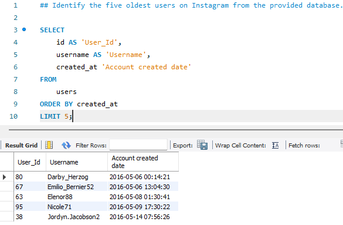
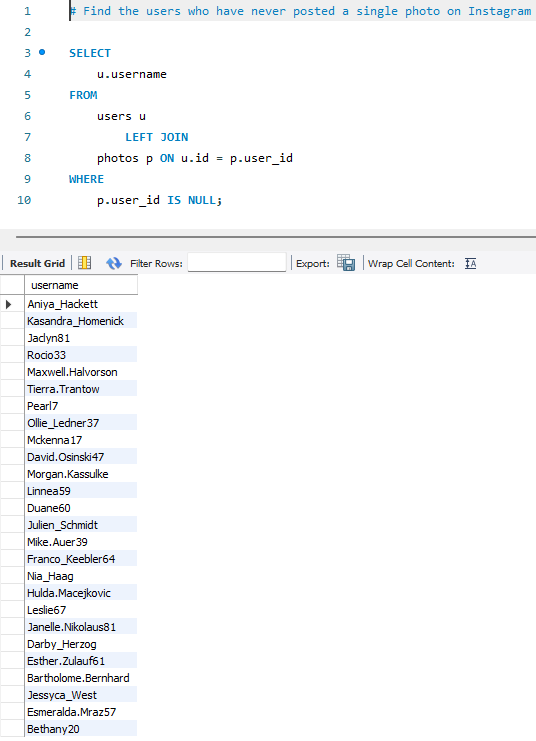
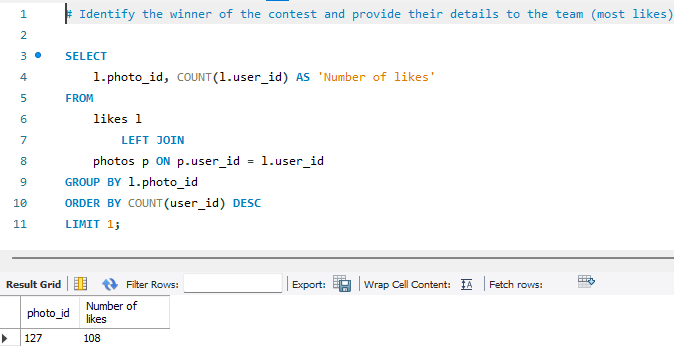
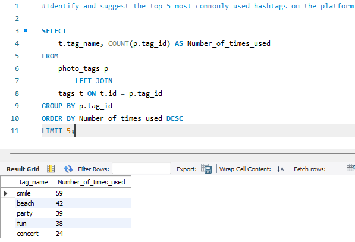
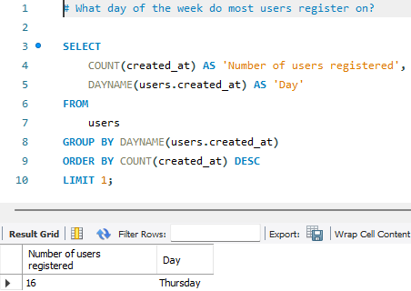
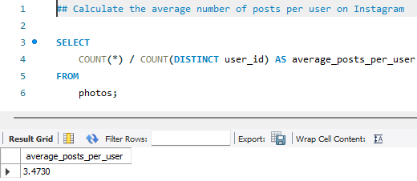
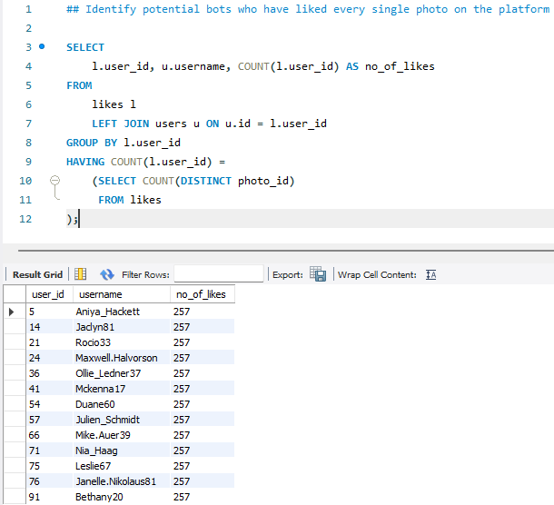

# 📘 Instagram User Analytics – SQL Project

## 📍 Project Overview

This project was undertaken as part of skill development in SQL and data analysis. It involves exploring Instagram user data to extract actionable insights related to user engagement and behavior. Through this analysis, the project demonstrates the ability to write complex SQL queries to answer practical business questions in marketing, product management, and investor relations.

The work simulates real-world data challenges and uses MySQL Workbench to manipulate and analyze relational datasets effectively.

## 🎯 Objectives

The project is divided into two segments:

### A) Marketing Analysis
- Identify the most loyal (longest active) users.
- Find inactive users who have never posted.
- Determine the contest winner (most liked photo).
- Discover the top 5 most popular hashtags.
- Recommend the best day to launch an ad campaign based on user sign-ups.

### B) Investor Metrics
- Evaluate user engagement by calculating average posts per user.
- Detect potential bots or fake accounts based on unusual activity (e.g., liking every photo).

---
Queries were executed using **MySQL Workbench**.
---

## 📌 Query Details

---

### Query 1: Find the 5 Oldest Users on Instagram

**Description:**  
Identifies the five oldest registered users based on their account creation date.

**SQL Script:** [`sql_scripts/1_oldest_users.sql`](sql_scripts/1_oldest_users.sql)

**Result Preview:**  

---

### Query 2: Find Users Who Have Never Posted a Single Photo

**Description:**  
Lists users who have not posted any photos, useful for targeting inactive users.

**SQL Script:** [`sql_scripts/2_no_posts.sql`](sql_scripts/2_no_posts.sql)

**Result Preview:**  

---

### Query 3: Identify the Contest Winner (User with Most Likes on a Single Photo)

**Description:**  
Finds the photo with the highest number of likes and identifies its owner.

**SQL Script:** [`sql_scripts/3_contest_winner.sql`](sql_scripts/3_contest_winner.sql)

**Result Preview:**  

---

### Query 4: Top 5 Most Commonly Used Hashtags

**Description:**  
Shows the five most popular hashtags based on frequency of use across photos.

**SQL Script:** [`sql_scripts/4_top_hashtags.sql`](sql_scripts/4_top_hashtags.sql)

**Result Preview:**  

---

### Query 5: Best Day to Launch Ad Campaign (Most User Registrations)

**Description:**  
Determines the day of the week with the highest user registrations, helping to time marketing campaigns.

**SQL Script:** [`sql_scripts/5_best_ad_day.sql`](sql_scripts/5_best_ad_day.sql)

**Result Preview:**  

---

### Query 6: Average Number of Posts Per User

**Description:**  
Calculates the average number of photos posted per user to gauge engagement.

**SQL Script:** [`sql_scripts/6_avg_posts_per_user.sql`](sql_scripts/6_avg_posts_per_user.sql)

**Result Preview:**  

---

### Query 7: Identify Potential Bots (Users Who Liked Every Photo)

**Description:**  
Detects suspicious accounts that have liked every photo, which may indicate bot or fake accounts.

**SQL Script:** [`sql_scripts/7_potential_bots.sql`](sql_scripts/7_potential_bots.sql)

**Result Preview:**  

---

## 🛠️ Database Setup Instructions

Before running the SQL queries, you need to create the database schema and load the sample data. Follow these simple steps:

1. **Clone or download** this repository to your local machine.

2. Open **MySQL Workbench** and connect to your MySQL server instance.

3. Locate the SQL script file named `database_initialize.sql` in the sql_scripts folder.

4. Open the `database_initialize.sql` file in MySQL Workbench.

5. **Execute** the script by clicking the “Run” button (⚡️). This will:

   - Create the necessary database and tables (`users`, `photos`, `likes`, `tags`, `photo_tags`)
   - Insert sample data into each table for the project analysis.

6. Once the script completes successfully, your database will be ready for running the query scripts located in the `sql_scripts` folder.

## 🚀 How to Run the SQL Scripts

1. Clone or download this repository.
2. Open MySQL Workbench and connect to your database.
3. Open any `.sql` file from the `sql_scripts` folder.
4. Execute the query to see the results.

